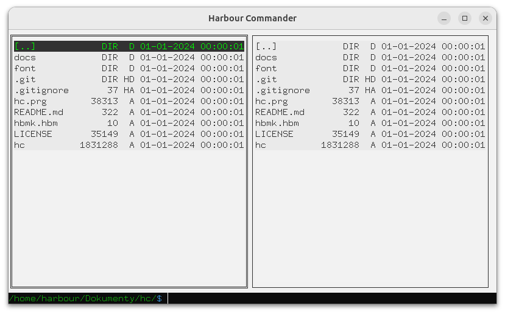

# Harbour Commander

`hc` is a lightweight, cross-platform file manager featuring a dual-pane interface. It is designed for speed and ease of use. 

### To build and run hc:

- First, build a library [HBSDL](https://github.com/dev-harbour/hbsdl)

### Example

File manager [hc.c](hc.c)

